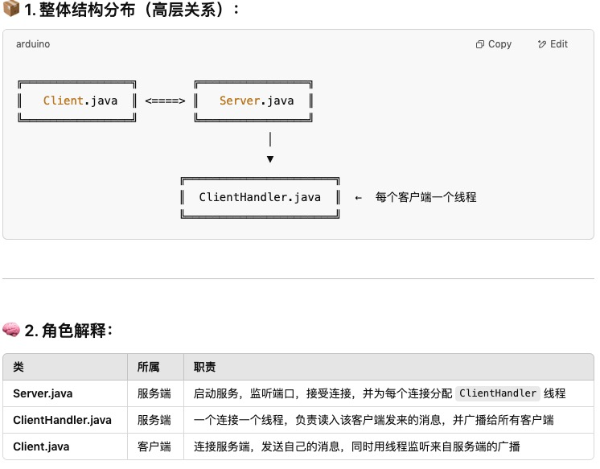

# 🗨️ Java Socket ChatRoom (多线程聊天室项目)

一个基于 Java Socket 实现的命令行聊天室，支持多个客户端同时连接、消息群发，整合了**网络通信（Socket）+ 多线程（Thread）+ 并发控制（synchronized）**等关键知识点。

A command-line chatroom built with Java Socket, supporting multiple concurrent clients and message broadcasting. It integrates key Java concepts including **networking (Socket)**, **multithreading (Thread)**, and **concurrency control (synchronized)**.

---

## 📦 项目结构

---

## ✨ 功能简介

- ✅ Multiple client connections 多客户端同时连接
- ✅ Server receives and broadcasts messages automatically 服务端自动接收消息并群发广播
- ✅ Each client is handled by a separate thread 每个客户端独立线程处理，互不干扰
- ✅ Clean and intuitive command-line I/O 命令行输入输出，简洁直观

---

## 🔧 类之间的协作说明（高层架构）

| 类名 / Class | 所属 / Side | 职责说明 / Responsibility |
|--------------|-------------|-----------------------------|
| `Server.java` | 服务端 / Server | 启动服务、监听端口、分配线程 Starts server, listens on port, assigns threads |
| `ClientHandler.java` | 服务端 / Server | 独立线程处理每个客户端，广播消息 Handles a single client per thread, broadcasts messages |
| `Client.java` | 客户端 / Client | 连接服务端、发送消息、接收广播 Connects to server, sends input, receives broadcasts |

---

## 🚀 如何运行 / How to Run

### ✅ 第一步：启动服务器 / Start Server

Run `Server.java` in IntelliJ or terminal:

---

## 🚀 如何运行

### ✅ 第一步：启动服务器

在 IntelliJ IDEA 中运行 `Server.java`

### ✅ 第二步：运行客户端

分别运行多个 `Client.java` 实例（可开多个控制台窗口）  
输入任意消息 → 所有连接用户都会收到

---

## 🧠 技术要点回顾

- `Socket` / `ServerSocket` 实现 TCP 通信
- `Thread` + `Runnable` 实现客户端并发处理
- `BufferedReader` / `PrintWriter` 实现行级文本通信
- `synchronized` 确保多个线程安全访问共享 `List<PrintWriter>`

## 🧠 Core Concepts

- `Socket` / `ServerSocket` for TCP communication
- `Thread` + `Runnable` for concurrent handling
- `BufferedReader` / `PrintWriter` for line-based messaging
- `synchronized` for thread-safe broadcasting list access
---

## 🛠️ 后续扩展建议（可作为进阶练习）

- ✅ 给客户端设置昵称
- ✅ 添加 `/quit` 命令退出聊天室
- ✅ 加入时间戳、用户名显示格式
- ✅ 使用线程池代替手动 new Thread
- ✅ 用 JavaFX 或 Swing 实现 GUI 图形界面

---

